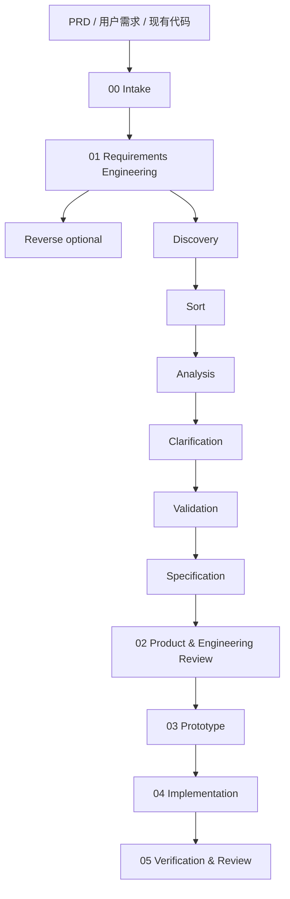

# AI Dev Workflow

AI Dev Workflow 是一个轻量、可控、以阶段产物交接为核心的 AI 研发工作流编排器。

它把一个 PRD 或原始需求，拆成一条清晰的研发链路：

```text
PRD → Requirements → Product & Engineering Review → Prototype → Implementation → Verification
```

核心目标不是让 AI 一口气自动做完所有事，而是让每个阶段都有明确输入、明确输出、人工确认点和可验证证据。

## 为什么需要它

直接让 AI 根据 PRD 写代码，常见问题是：

- 需求还没澄清就开始实现
- PRD 里的重要内容被漏掉
- AI 自己扩大或缩小范围
- 中途换 agent 后无法接手
- 最后只说“完成了”，但没有测试证据
- 过程埋在聊天记录里，难复盘、难版本管理

AI Dev Workflow 的做法是：

```text
用固定 artifact 文件承载上下文，
用阶段门禁控制节奏，
用评估标准验证流程是否真的有效，
同时保持能力提供者可替换、workflow artifact contract 稳定。
```

## 核心原则

- **产物优先**：阶段输出必须写入文件，而不是只留在聊天记录里。
- **人工门禁**：关键阶段默认暂停，等待人确认后再继续。
- **能力编排**：按能力组织流程，而不是绑定某个固定工具。
- **稳定契约**：AI Dev Workflow 定义阶段、门禁、产物位置和交接规则；外部 skill 只提供能力。
- **可替换 skill**：`requirements-analyst`、gstack-style review、`superpowers` 是默认选择，但不是硬依赖。
- **保留 provider 原生产物**：例如 requirements 阶段允许 `requirements-analyst` 在 `requirements/` 下保留更丰富的详细文档，`01_REQUIREMENTS.md` 只做摘要、索引和门禁。
- **先原型后实现**：先用静态 HTML/CSS 验证页面、流程、角色和状态，再进入正式实现。
- **先小后大**：第一版只做最小可用流程，不急着引入复杂状态机。

## 默认工作流

```text
00 Intake
01 Requirements Engineering
   ├─ Reverse optional
   ├─ Discovery
   ├─ Sort
   ├─ Analysis
   ├─ Clarification
   ├─ Validation
   └─ Specification
02 Product & Engineering Review
03 Prototype
04 Implementation Planning & Build
05 Verification & Review
```

完整流程图见：[Workflow Overview](references/workflow-overview.md)。



默认生成的工作目录：

```text
.ai-workflow/<feature-slug>/
├── 00_INTAKE.md
├── 01_REQUIREMENTS.md
├── requirements/
│   ├── reverse.md              # optional
│   ├── discovery.md
│   ├── sort.md
│   ├── requirements.md
│   ├── datamodel.md
│   ├── clarification.md
│   ├── validation.md
│   ├── prd.md
│   ├── api.yaml                # optional
│   ├── open-questions.md
│   └── traceability.md
├── 02_TECHNICAL_DESIGN.md
├── 03_PROTOTYPE.md
├── prototype/
│   ├── index.html
│   ├── css/
│   │   └── style.css
│   └── pages/
├── 04_IMPLEMENTATION.md
├── 05_REVIEW.md
└── STATUS.md
```

## 快速开始

用一个 PRD 初始化工作流：

```bash
python3 scripts/init_workflow.py \
  --project-root "/path/to/project" \
  --source-prd "/path/to/project/PRD.md" \
  --feature "feature-name"
```

校验 artifact 是否完整：

```bash
python3 scripts/validate_artifacts.py "/path/to/project/.ai-workflow/<feature-slug>"
```

查看当前状态：

```bash
python3 scripts/status.py "/path/to/project/.ai-workflow/<feature-slug>"
```

## 文档

- [使用说明](USAGE.md)：详细说明如何初始化、推进阶段、检查 artifact。
- [评估标准](EVALUATION.md)：说明如何判断这套流程是否真的比裸聊天更好。

## 仓库结构

```text
ai-dev-workflow/
├── SKILL.md
├── README.md
├── USAGE.md
├── EVALUATION.md
├── references/
├── assets/templates/
└── scripts/
```

## 当前状态

这是一个早期 MVP，目标是先通过真实 PRD 跑完整链路，验证这套 artifact-first、human-gated、capability-based 的 AI 研发流程是否真的比裸聊天更稳定。

## License

MIT
