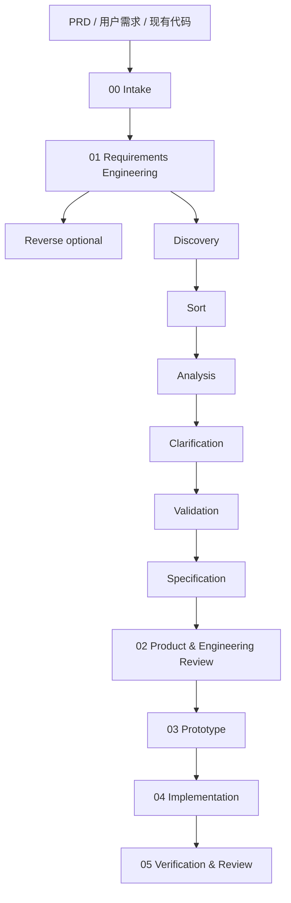

# AI Dev Workflow

AI Dev Workflow 是一个可控、contract-driven 的 orchestrated Claude Code workflow package。

它把一个 PRD 或原始需求，拆成一条清晰、可恢复、可审计的研发链路：

```text
PRD → Requirements → Product & Engineering Review → Prototype → Implementation → Verification
```

核心目标不是让 AI 一口气自动做完所有事，而是让每个阶段都有明确输入、明确输出、人工确认点、provider contract、强制 gate、失败修复循环和可验证证据。

## 为什么需要它

直接让 AI 根据 PRD 写代码，常见问题是：

- 需求还没澄清就开始实现
- PRD 里的重要内容被漏掉
- AI 自己扩大或缩小范围
- 外部 skill 的强能力被压缩成一份浅 summary
- 中途换 agent 后无法接手
- 最后只说“完成了”，但没有测试证据
- 过程埋在聊天记录里，难复盘、难版本管理

AI Dev Workflow 的做法是：

```text
用固定 artifact 文件承载上下文，
用阶段门禁控制节奏，
用 provider contract 约束 skill 接入方式，
保留 provider-native 深度产物，
同时保持能力提供者可替换、workflow artifact contract 稳定。
```

## 核心模型：Contract / Artifact / Gate / Provider

AI Dev Workflow 的核心不是“多写几份文档”，而是把 AI 研发过程拆成四个相互制约的部分：

```text
Contract 规定规则
Artifact 承载事实
Gate 检查事实是否符合规则
Provider 提供专业能力
```

### Contract：流程契约

Contract 是 workflow 的规则层。它定义：

- 每个阶段必须读取哪些输入；
- 输出必须写到哪些文件；
- 哪些 provider 产物必须完整保留；
- 哪些节点必须等人确认；
- 什么情况算 `DONE`、`BLOCKED`、`DEGRADED`；
- 下游阶段如何消费上游产物；
- 什么行为越界，例如自我批准、跳过澄清、先写代码后补计划。

例如 04 的 contract 要求：先写 `implementation/IMPLEMENTATION_PLAN.md`，通过 `04-plan` gate，等待用户明确批准，然后才能写业务代码；实现后还必须记录执行日志、验证命令、变更文件和追踪关系。

### Artifact：文件化事实

Artifact 是 workflow 里的实际产物文件，例如：

```text
00_INTAKE.md
01_REQUIREMENTS.md
requirements/requirements.md
requirements/clarification.md
requirements/traceability.md
requirements/api.yaml
02_TECHNICAL_DESIGN.md
reviews/*.md
03_PROTOTYPE.md
prototype/
04_IMPLEMENTATION.md
implementation/IMPLEMENTATION_PLAN.md
05_REVIEW.md
STATUS.md
```

Artifact 的作用是把 AI 的过程从“聊天里的临时记忆”变成可检查、可恢复、可交接的项目记录：

- 阶段输出写入文件，而不是只停留在聊天记录；
- 下游阶段通过 artifact 接收上游结论；
- provider-native 深度产物不会被压缩成一段 summary；
- 中途换 agent、压缩上下文或恢复会话时，可以从文件继续；
- gate 可以检查真实文件，而不是检查模型口头承诺。

### Gate：强制检查

Gate 是脚本化检查，主要由 `scripts/validate_artifacts.py` 和 `scripts/orchestrate.py` 执行。

它不相信“我已经完成了”这种口头说法，而是检查 artifact：

- `01-full`：需求深度、澄清、人类决策来源、traceability、API contract；
- `02-full`：gstack/review 深度、设计决策、traceability 主矩阵回填；
- `03-full`：原型文件、页面映射、原型审批；
- `04-plan`：superpowers writing-plans 结构、输入消费证据、无自批、无提前写代码；
- `04-complete`：人工执行批准、执行日志、验证命令、变更文件；
- `05-complete`：测试/build/lint、API parity、browser smoke、风险复查和发布建议证据。

如果 gate 失败，workflow 必须修 artifact、补证据、问用户或标记 degraded/blocker，不能直接进入下一阶段。

### Provider：能力提供者

Provider 是外部或内置的专业能力来源，例如：

- `requirements-analyst`：需求澄清、分析、验证和 PRD/API/traceability 产物；
- `garrytan/gstack`：产品、工程、安全、QA 等多角色评审；
- `superpowers`：writing-plans、TDD、执行计划、完成前验证；
- compact fallback：当外部 provider 不可用时的降级能力。

Provider 不拥有 workflow 状态。它们只提供方法和深度输出；AI Dev Workflow 负责把这些输出映射进稳定 artifact，并用 gate 验收。

### 四者的关系

```text
Provider 产生专业输出
        ↓
Artifact 保存输出、决策和证据
        ↓
Gate 检查 artifact 是否满足 contract
        ↓
Contract 决定能否进入下一阶段
```

因此，这套 workflow 真正要保证的是：

> 不是让 AI “记得应该怎么做”，而是让它不按 contract 落 artifact、不过 gate，就不能声称完成。

### 为什么 Artifact 不等于普通文档

普通文档可以事后补、可以写得很漂亮但不影响流程。这里的 artifact 是 workflow 状态机的一部分：

- `clarification.md` 没有人类决策来源，`01-full` 不能过；
- `traceability.md` 设计列没回填，`02-full` 不能过；
- `03_PROTOTYPE.md` 没有原型审批，不能进 04；
- `04_IMPLEMENTATION.md` 没有执行批准和验证证据，不能进 05；
- `05_REVIEW.md` 没有测试/风险/发布证据，不能宣称完成。

所以 artifact 不是“给人看的附属文档”，而是 workflow 的事实数据库和审计对象。

## 核心原则

- **产物优先**：阶段输出必须写入文件，而不是只留在聊天记录里。
- **人工门禁**：关键阶段默认暂停，等待人确认后再继续。
- **能力编排**：按能力组织流程，而不是绑定某个固定工具。
- **稳定契约**：AI Dev Workflow 定义阶段、门禁、产物位置、状态机、失败修复循环和交接规则；外部 skill 只提供能力。
- **语言一致性**：初始化时根据用户请求 / PRD 判定 `Artifact language`，后续阶段的用户可见回复和 workflow artifact 正文必须保持一致；provider 原生英文输出必须映射/本地化后再进入 artifact。
- **可替换 skill**：`requirements-analyst`、真实外部 `garrytan/gstack`（经 adapter）、`superpowers` 是默认选择，但不是硬依赖。
- **保留 provider 原生产物**：深度产物放在阶段子目录中，阶段主文件只做摘要、索引、门禁和证据。
- **先原型后实现**：先用静态 HTML/CSS 验证页面、流程、角色和状态，再进入正式实现。
- **先计划后执行**：04 默认只写实现计划，不直接写业务代码；执行需要显式批准。
- **API 合同优先**：只要存在前后端 / client-server / 服务间 HTTP 边界，`requirements/api.yaml` 就是必需交接物；04/05 必须做 contract ↔ backend routes ↔ frontend client calls 三方对账，且覆盖 method/path、必填字段、枚举值、request/response shape、权限和状态副作用。
- **不重复发散**：04 不重新完整 brainstorming；01/02/03 已完成需求澄清、方案评审、决策确认和原型验证。

## Contract 是什么

这里的 `contract` 指“契约 / 接口协议”，不是对比。

它规定每个 provider / skill 接入 workflow 时：

```text
输入是什么
输出放哪里
哪些详细产物必须保留
什么时候必须停下来等人确认
什么行为越界
什么情况算失败
```

例如：

- 01 使用 requirements-analyst 思路，但详细需求产物必须保留在 `requirements/`。
- 02 优先使用真实外部 garrytan/gstack，经 gstack-adapter 映射；review-pack 仅 degraded fallback，但多角色深度评审必须保留在 `reviews/`。
- 03 使用 requirements-driven prototype generation，但先写 prototype plan，再生成静态 HTML/CSS 页面。
- 04 使用 superpowers writing-plans / TDD / verification，但深度实现计划必须保留在 `implementation/IMPLEMENTATION_PLAN.md`，并拆成带文件、命令、验证、通过标准和失败处理的小步执行单元。

一句话：

```text
skill 提供能力，workflow contract 提供秩序。
```

## 默认工作流

```text
00 Intake
01 Requirements Engineering
   ├─ Reverse optional
   ├─ Discovery
   ├─ Sort
   ├─ Analysis
   ├─ Clarification
   ├─ Validation
   └─ Specification
02 Product & Engineering Review
03 Prototype
04 Implementation Planning & Build
05 Verification & Review
```

完整流程图见：[Workflow Overview](references/workflow-overview.md)。



默认生成的工作目录：

```text
.ai-workflow/<feature-slug>/
├── 00_INTAKE.md
├── 01_REQUIREMENTS.md              # 01 摘要 / 索引 / 门禁
├── requirements/                   # requirements-analyst 风格深度产物
│   ├── reverse.md                  # optional
│   ├── discovery.md
│   ├── sort.md
│   ├── requirements.md
│   ├── datamodel.md
│   ├── clarification.md
│   ├── validation.md
│   ├── prd.md
│   ├── api.yaml                    # API 边界存在时必需
│   ├── open-questions.md
│   └── traceability.md
├── 02_TECHNICAL_DESIGN.md          # 02 摘要 / 决策 / 门禁
├── reviews/                        # review-pack 多角色深度评审
│   ├── product-review.md
│   ├── engineering-review.md
│   ├── security-risk-review.md
│   └── qa-review.md
├── 03_PROTOTYPE.md                 # 原型计划 / 页面映射 / 审批
├── prototype/                      # 静态 HTML/CSS 原型
│   ├── index.html
│   ├── css/
│   │   └── style.css
│   └── pages/
├── 04_IMPLEMENTATION.md            # 04 摘要 / 门禁 / 执行证据 / 索引
├── implementation/
│   └── IMPLEMENTATION_PLAN.md      # superpowers writing-plans 权威深计划
├── 05_REVIEW.md
└── STATUS.md
```

## 阶段与默认 provider

| 阶段 | 目标 | 默认 provider / 方法 | 深度产物 |
|---|---|---|---|
| 00 Intake | 建立 workflow 目录和输入摘要 | ai-dev-workflow | `00_INTAKE.md` |
| 01 Requirements | 需求澄清、规格化、验证标准 | requirements-analyst | `requirements/` |
| 02 Review | 产品/工程/安全/QA 多角色评审与决策 | gstack-adapter over real garrytan/gstack；review-pack degraded fallback | `reviews/` |
| 03 Prototype | 先计划，再生成静态原型验证流程 | requirements-driven prototype generation | `prototype/` |
| 04 Implementation | 深度实现计划、TDD、执行证据 | superpowers writing-plans / TDD | `implementation/IMPLEMENTATION_PLAN.md` |
| 05 Verification | 完成前验证、review、风险证据 | superpowers + optional gstack-adapter | `05_REVIEW.md` |

## 关键门禁

默认不连续无脑推进：

```text
01 有 open questions → 停下来等需求确认
02 有 open decisions → 停下来等方案/技术决策确认
03 prototype 未批准 → 不能进入 04
04 implementation plan 未批准 → 不能写业务代码
05 测试/build/lint/QA 无证据 → 不能声明完成
API 合同缺失或未对齐、前端 smoke 等级不足 → 不能声明前端全流程可用
缺 `api.yaml` 的 API 项目 → 必须标记 API_CONTRACT_DEGRADED，不能宣称完整 contract parity
```

## Claude Code 安装

本仓库同时也是一个 Claude Code plugin。安装后，Claude Code 会扫描 skill 和 `commands/run.md`。推荐直接用自然语言触发，或使用短命令 `/ai-dev-workflow:run`：

```text
使用 ai-dev-workflow，基于 PRD.md 初始化工作流。

/ai-dev-workflow:run 基于 PRD.md 初始化工作流。
```

本机可通过本地 marketplace 安装：

```bash
claude plugin marketplace add --scope user ~/.claude/local-marketplaces/ai-dev-workflow-marketplace
claude plugin install --scope user ai-dev-workflow@melody-local
```

检查安装状态：

```bash
claude plugin list
```

## 快速开始

用一个 PRD 初始化工作流：

```bash
python3 scripts/init_workflow.py \
  --project-root "/path/to/project" \
  --source-prd "/path/to/project/PRD.md" \
  --feature "feature-name"
```

运行带状态写回的 phase gate：

```bash
python3 scripts/orchestrate.py gate "/path/to/project/.ai-workflow/<feature-slug>" 01
python3 scripts/orchestrate.py validate-all "/path/to/project/.ai-workflow/<feature-slug>" --all
```

校验 artifact 是否完整：

```bash
python3 scripts/validate_artifacts.py "/path/to/project/.ai-workflow/<feature-slug>"
```

查看当前状态：

```bash
python3 scripts/status.py "/path/to/project/.ai-workflow/<feature-slug>"
```

## 和直接提示词调用 skill 的区别

直接在 prompt 里调用三个 skill，本质是临时手工指挥：

```text
这次提示词写得好 → 跑得好
下次忘了某个约束 → 容易跑偏
```

AI Dev Workflow 则把经验固化为文件化 contract：

```text
阶段顺序稳定
产物位置稳定
详细产物不被压缩
人工门禁明确
中途断会话也能恢复
provider 可以替换
```

所以它不是第四个大 skill，而是一个多 skill 编排层。

## 文档

- [使用说明](USAGE.md)：详细说明如何初始化、推进阶段、检查 artifact。
- [Artifact Spec](references/artifact-spec.md)：阶段产物、详细产物和目录结构契约。
- [Orchestration](references/orchestration.md)：状态机、provider registry、强制 gate loop 和恢复命令。
- [Phase Routing](references/phase-routing.md)：阶段推进、handoff 和门禁规则。
- [工作流总览](references/workflow-overview.md)：主流程与 requirements 子流程图。
- [能力契约](references/capability-contracts.md)：各阶段 provider 输入、输出和完成条件。
- [Review Pack Contract](references/provider-contracts/review-pack.md)：产品/工程/安全风险/QA 多角色评审契约。
- [superpowers Execution Contract](references/provider-contracts/superpowers-execution.md)：计划、TDD、执行和完成前验证契约。
- [评估标准](EVALUATION.md)：说明如何判断这套流程是否真的比裸聊天更好。

## Templates / Source Skill Slices

这些文件是 workflow 运行时应加载或映射的模板 / 原生能力切片，不是 README 摘要。

### Workflow artifact templates

- [scripts/init_workflow.py](scripts/init_workflow.py)：初始化 `00_INTAKE.md`、`01_REQUIREMENTS.md`、`02_TECHNICAL_DESIGN.md`、`03_PROTOTYPE.md`、`04_IMPLEMENTATION.md`、`05_REVIEW.md`、`STATUS.md`。
- [references/artifact-spec.md](references/artifact-spec.md)：各阶段 artifact 结构和必需内容。
- [references/phase-routing.md](references/phase-routing.md)：阶段推进、停止点和 gate 顺序。

### requirements-analyst templates

`requirements-analyst` 在本仓库中保留 source-derived steering/templates；Phase 01/03 需要按需加载这些文件，而不是只读摘要：

- [template-discovery.md](providers/requirements-analyst/references/steering/template-discovery.md)
- [template-sort.md](providers/requirements-analyst/references/steering/template-sort.md)
- [template-analysis.md](providers/requirements-analyst/references/steering/template-analysis.md)
- [template-data-model.md](providers/requirements-analyst/references/steering/template-data-model.md)
- [template-clarification.md](providers/requirements-analyst/references/steering/template-clarification.md)
- [template-validation.md](providers/requirements-analyst/references/steering/template-validation.md)
- [template-prd.md](providers/requirements-analyst/references/steering/template-prd.md)
- [template-openapi.md](providers/requirements-analyst/references/steering/template-openapi.md)
- [template-rtm.md](providers/requirements-analyst/references/steering/template-rtm.md)

### superpowers source skill slices

`superpowers` 优先通过外部 plugin 原生调用；若运行环境不能原生调用，使用本仓库保留的 source skill slices，并标记 `BUNDLED_SOURCE_SLICE`：

- [writing-plans/SKILL.md](providers/superpowers-adapter/references/source-skills/writing-plans/SKILL.md)：04 实现计划原生格式。
- [writing-plans/plan-document-reviewer-prompt.md](providers/superpowers-adapter/references/source-skills/writing-plans/plan-document-reviewer-prompt.md)：实现计划评审 prompt。
- [test-driven-development/SKILL.md](providers/superpowers-adapter/references/source-skills/test-driven-development/SKILL.md)：TDD 纪律。
- [executing-plans/SKILL.md](providers/superpowers-adapter/references/source-skills/executing-plans/SKILL.md)：按计划执行。
- [subagent-driven-development/SKILL.md](providers/superpowers-adapter/references/source-skills/subagent-driven-development/SKILL.md)：子代理逐任务实现 + 评审流程。
- [verification-before-completion/SKILL.md](providers/superpowers-adapter/references/source-skills/verification-before-completion/SKILL.md)：完成前验证。
- [requesting-code-review/SKILL.md](providers/superpowers-adapter/references/source-skills/requesting-code-review/SKILL.md)：代码评审请求/模拟。

### gstack adapter

`gstack` 当前没有 vendored 模板。它是外部真实 `garrytan/gstack` 的 adapter：只有安装并实际使用对应外部 slice（如 `plan-ceo-review`、`plan-eng-review`、`review`、`qa`、`cso`）时，才记录为 `ADAPTER_FULL`。

- [providers/gstack-adapter/SKILL.md](providers/gstack-adapter/SKILL.md)：gstack slice 到 `reviews/`、`02_TECHNICAL_DESIGN.md`、`05_REVIEW.md` 和 traceability 的映射规则。

## 仓库结构

```text
ai-dev-workflow/
├── SKILL.md
├── commands/
├── README.md
├── USAGE.md
├── EVALUATION.md
├── references/
├── assets/templates/
└── scripts/
```

## 当前状态

这是一个早期版本，目标是先通过真实 PRD 跑完整链路，验证这套 artifact-first、human-gated、contract-driven、capability-based 的 AI 研发流程是否真的比裸聊天更稳定。

当前重点不是扩大阶段数量，而是把 01-05 跑稳：需求不丢、评审不薄、原型可看、实现计划够深、验证有证据。

## License

MIT
