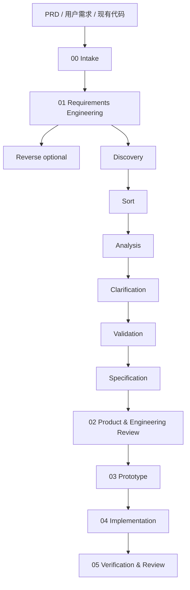

# AI Dev Workflow

AI Dev Workflow 是一个轻量、可控、contract-driven 的 AI 研发工作流编排器。

它把一个 PRD 或原始需求，拆成一条清晰、可恢复、可审计的研发链路：

```text
PRD → Requirements → Product & Engineering Review → Prototype → Implementation → Verification
```

核心目标不是让 AI 一口气自动做完所有事，而是让每个阶段都有明确输入、明确输出、人工确认点、provider contract 和可验证证据。

## 为什么需要它

直接让 AI 根据 PRD 写代码，常见问题是：

- 需求还没澄清就开始实现
- PRD 里的重要内容被漏掉
- AI 自己扩大或缩小范围
- 外部 skill 的强能力被压缩成一份浅 summary
- 中途换 agent 后无法接手
- 最后只说“完成了”，但没有测试证据
- 过程埋在聊天记录里，难复盘、难版本管理

AI Dev Workflow 的做法是：

```text
用固定 artifact 文件承载上下文，
用阶段门禁控制节奏，
用 provider contract 约束 skill 接入方式，
保留 provider-native 深度产物，
同时保持能力提供者可替换、workflow artifact contract 稳定。
```

## 核心原则

- **产物优先**：阶段输出必须写入文件，而不是只留在聊天记录里。
- **人工门禁**：关键阶段默认暂停，等待人确认后再继续。
- **能力编排**：按能力组织流程，而不是绑定某个固定工具。
- **稳定契约**：AI Dev Workflow 定义阶段、门禁、产物位置和交接规则；外部 skill 只提供能力。
- **可替换 skill**：`requirements-analyst`、gstack-style review、`superpowers` 是默认选择，但不是硬依赖。
- **保留 provider 原生产物**：深度产物放在阶段子目录中，阶段主文件只做摘要、索引、门禁和证据。
- **先原型后实现**：先用静态 HTML/CSS 验证页面、流程、角色和状态，再进入正式实现。
- **先计划后执行**：04 默认只写实现计划，不直接写业务代码；执行需要显式批准。
- **不重复发散**：04 不重新完整 brainstorming；01/02/03 已完成需求澄清、方案评审、决策确认和原型验证。

## Contract 是什么

这里的 `contract` 指“契约 / 接口协议”，不是对比。

它规定每个 provider / skill 接入 workflow 时：

```text
输入是什么
输出放哪里
哪些详细产物必须保留
什么时候必须停下来等人确认
什么行为越界
什么情况算失败
```

例如：

- 01 使用 requirements-analyst 思路，但详细需求产物必须保留在 `requirements/`。
- 02 使用 gstack-style review，但多角色深度评审必须保留在 `reviews/`。
- 03 使用 requirements-driven prototype generation，但先写 prototype plan，再生成静态 HTML/CSS 页面。
- 04 使用 superpowers writing-plans / TDD / verification，但深度实现计划必须保留在 `implementation/IMPLEMENTATION_PLAN.md`。

一句话：

```text
skill 提供能力，workflow contract 提供秩序。
```

## 默认工作流

```text
00 Intake
01 Requirements Engineering
   ├─ Reverse optional
   ├─ Discovery
   ├─ Sort
   ├─ Analysis
   ├─ Clarification
   ├─ Validation
   └─ Specification
02 Product & Engineering Review
03 Prototype
04 Implementation Planning & Build
05 Verification & Review
```

完整流程图见：[Workflow Overview](references/workflow-overview.md)。



默认生成的工作目录：

```text
.ai-workflow/<feature-slug>/
├── 00_INTAKE.md
├── 01_REQUIREMENTS.md              # 01 摘要 / 索引 / 门禁
├── requirements/                   # requirements-analyst 风格深度产物
│   ├── reverse.md                  # optional
│   ├── discovery.md
│   ├── sort.md
│   ├── requirements.md
│   ├── datamodel.md
│   ├── clarification.md
│   ├── validation.md
│   ├── prd.md
│   ├── api.yaml                    # optional
│   ├── open-questions.md
│   └── traceability.md
├── 02_TECHNICAL_DESIGN.md          # 02 摘要 / 决策 / 门禁
├── reviews/                        # gstack-style 多角色深度评审
│   ├── product-review.md
│   ├── engineering-review.md
│   ├── security-risk-review.md
│   └── qa-review.md
├── 03_PROTOTYPE.md                 # 原型计划 / 页面映射 / 审批
├── prototype/                      # 静态 HTML/CSS 原型
│   ├── index.html
│   ├── css/
│   │   └── style.css
│   └── pages/
├── 04_IMPLEMENTATION.md            # 04 摘要 / 门禁 / 执行证据 / 索引
├── implementation/
│   └── IMPLEMENTATION_PLAN.md      # superpowers writing-plans 权威深计划
├── 05_REVIEW.md
└── STATUS.md
```

## 阶段与默认 provider

| 阶段 | 目标 | 默认 provider / 方法 | 深度产物 |
|---|---|---|---|
| 00 Intake | 建立 workflow 目录和输入摘要 | ai-dev-workflow | `00_INTAKE.md` |
| 01 Requirements | 需求澄清、规格化、验证标准 | requirements-analyst | `requirements/` |
| 02 Review | 产品/工程/安全/QA 多角色评审与决策 | gstack-style review | `reviews/` |
| 03 Prototype | 先计划，再生成静态原型验证流程 | requirements-driven prototype generation | `prototype/` |
| 04 Implementation | 深度实现计划、TDD、执行证据 | superpowers writing-plans / TDD | `implementation/IMPLEMENTATION_PLAN.md` |
| 05 Verification | 完成前验证、review、风险证据 | superpowers + optional gstack | `05_REVIEW.md` |

## 关键门禁

默认不连续无脑推进：

```text
01 有 open questions → 停下来等需求确认
02 有 open decisions → 停下来等方案/技术决策确认
03 prototype 未批准 → 不能进入 04
04 implementation plan 未批准 → 不能写业务代码
05 测试/build/lint/QA 无证据 → 不能声明完成
```

## Claude Code 安装

本仓库同时也是一个 Claude Code plugin。安装后，Claude Code 会扫描 `SKILL.md` 和 `commands/ai-dev-workflow.md`，因此可以直接用自然语言触发：

```text
使用 ai-dev-workflow，基于 PRD.md 初始化工作流。
```

本机可通过本地 marketplace 安装：

```bash
claude plugin marketplace add --scope user ~/.claude/local-marketplaces/ai-dev-workflow-marketplace
claude plugin install --scope user ai-dev-workflow@melody-local
```

检查安装状态：

```bash
claude plugin list
```

## 快速开始

用一个 PRD 初始化工作流：

```bash
python3 scripts/init_workflow.py \
  --project-root "/path/to/project" \
  --source-prd "/path/to/project/PRD.md" \
  --feature "feature-name"
```

校验 artifact 是否完整：

```bash
python3 scripts/validate_artifacts.py "/path/to/project/.ai-workflow/<feature-slug>"
```

查看当前状态：

```bash
python3 scripts/status.py "/path/to/project/.ai-workflow/<feature-slug>"
```

## 和直接提示词调用 skill 的区别

直接在 prompt 里调用三个 skill，本质是临时手工指挥：

```text
这次提示词写得好 → 跑得好
下次忘了某个约束 → 容易跑偏
```

AI Dev Workflow 则把经验固化为文件化 contract：

```text
阶段顺序稳定
产物位置稳定
详细产物不被压缩
人工门禁明确
中途断会话也能恢复
provider 可以替换
```

所以它不是第四个大 skill，而是一个多 skill 编排层。

## 文档

- [使用说明](USAGE.md)：详细说明如何初始化、推进阶段、检查 artifact。
- [Artifact Spec](references/artifact-spec.md)：阶段产物、详细产物和目录结构契约。
- [Phase Routing](references/phase-routing.md)：阶段推进、handoff 和门禁规则。
- [工作流总览](references/workflow-overview.md)：主流程与 requirements 子流程图。
- [能力契约](references/capability-contracts.md)：各阶段 provider 输入、输出和完成条件。
- [gstack Review Contract](references/provider-contracts/gstack-review.md)：产品/工程/安全风险/QA 多角色评审契约。
- [superpowers Execution Contract](references/provider-contracts/superpowers-execution.md)：计划、TDD、执行和完成前验证契约。
- [评估标准](EVALUATION.md)：说明如何判断这套流程是否真的比裸聊天更好。

## 仓库结构

```text
ai-dev-workflow/
├── SKILL.md
├── commands/
├── README.md
├── USAGE.md
├── EVALUATION.md
├── references/
├── assets/templates/
└── scripts/
```

## 当前状态

这是一个早期版本，目标是先通过真实 PRD 跑完整链路，验证这套 artifact-first、human-gated、contract-driven、capability-based 的 AI 研发流程是否真的比裸聊天更稳定。

当前重点不是扩大阶段数量，而是把 01-05 跑稳：需求不丢、评审不薄、原型可看、实现计划够深、验证有证据。

## License

MIT
