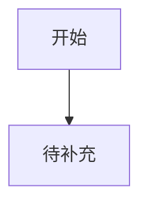
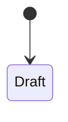

# 详细需求分析 — {{FEATURE_NAME}}

## 目的

记录需求分析 provider 产出的**完整原生需求分析文档**。

本文件不是摘要表。它应该尽量保留 `requirements-analyst` 的深度和结构；如果单独运行 `requirements-analyst` 会产出用户画像、活动流、故事地图、用户故事、验收条件、INVEST 检查、边界情况等内容，这些内容应优先放在本文件中。

`01_REQUIREMENTS.md` 只做 workflow 级摘要、索引和门禁；不要把本文件压缩进 `01_REQUIREMENTS.md`。

## 1. 用户角色画像

| 角色 | 描述 | 核心目标 |
|---|---|---|
|  |  |  |

## 2. 核心用户活动流

### 活动图 / 状态图

_使用 Mermaid 或文字流程描述核心活动流。_



### 活动详情

| 活动 | 描述 | 输入 | 输出 | 参与角色 |
|---|---|---|---|---|
|  |  |  |  |  |

## 3. 用户故事地图

_按用户活动从左到右组织故事，并按本轮交付 / 后续版本 / 增强能力分层。_

| 活动 | 本轮交付 | 后续增强 | 备注 |
|---|---|---|---|
|  |  |  |  |

## 4. 用户故事

### US-001：待命名

**优先级**：P0/P1/P2
**角色**：
**版本/交付批次**：

**故事**：

> 作为一名 **[角色]**，
> 我希望 **[能力]**，
> 以便 **[价值]**。

**验收条件**：

```gherkin
Scenario: 待补充
  Given 前置条件
  When 用户操作
  Then 系统结果
```

**INVEST 检查**：

- [ ] Independent（独立）
- [ ] Negotiable（可协商）
- [ ] Valuable（有价值）
- [ ] Estimable（可估算）
- [ ] Small（足够小）
- [ ] Testable（可测试）

**依赖 / 备注**：

- TBD

## 5. 功能需求

| ID | 功能 | 描述 | 来源 | 优先级 |
|---|---|---|---|---|
|  |  |  |  |  |

## 6. 非功能需求

| ID | 需求 | 说明 | 验证方式 |
|---|---|---|---|
|  |  |  |  |

## 7. 角色与权限

| 操作 | 角色 A | 角色 B | 角色 C | 备注 |
|---|---|---|---|---|
|  |  |  |  |  |

## 8. 状态机 / 生命周期

_记录核心实体状态、状态转换条件、异常路径和不可逆状态。_



## 9. 边界情况和约束

- TBD

## 10. 需求质量检查

- [ ] 用户故事有明确角色、能力和价值
- [ ] 核心流程和分支流程均覆盖
- [ ] 验收条件可测试
- [ ] 角色权限边界明确
- [ ] 状态机闭环
- [ ] 非功能需求可验证
- [ ] 开放问题没有被猜测填平
