# Workflow Overview

This workflow keeps the process controllable while allowing stronger skills to be swapped in later.

Core principle:

> AI Dev Workflow owns the workflow contract. External skills provide capabilities. Artifacts are the stable interface between phases.

## Flow diagram

```mermaid
flowchart TD
    A[Raw PRD / user request / existing codebase] --> B[00 Intake\nNormalize source and create workflow directory]
    B --> G{01 Requirements Engineering\nrequirements-analyst as provider}

    G --> R0{Existing code\nwithout reliable docs?}
    R0 -- Yes --> R1[Reverse\nrequirements/reverse.md]
    R0 -- No --> R2[Discovery\nrequirements/discovery.md]
    R1 --> R2
    R2 --> R3[Sort / Prioritize\nrequirements/sort.md]
    R3 --> R4[Analysis\nrequirements/requirements.md\nrequirements/datamodel.md]
    R4 --> R5[Clarification\nrequirements/clarification.md\nrequirements/open-questions.md]
    R5 --> R6[Validation\nrequirements/validation.md]
    R6 --> R7{Validation passed?}
    R7 -- Missing / inconsistent --> R4
    R7 -- Ambiguous / unverifiable --> R5
    R7 -- Pass --> R8[Specification\nrequirements/prd.md\nrequirements/api.yaml optional\nrequirements/traceability.md]
    R8 --> R9[01_REQUIREMENTS.md\nSummary, index, approval, handoff]

    R9 --> H{Human gate\nRequirements approved?}
    H -- Changes needed --> G
    H -- Approved --> C[02 Product & Engineering Review\nScope, MVP, architecture, risks, test strategy]

    C --> I{Human gate\nDesign approved?}
    I -- Changes needed --> C
    I -- Approved --> D[03 Prototype\nStatic HTML/CSS decision artifact]

    D --> J{Human gate\nPrototype approved or skipped?}
    J -- Changes needed --> D
    J -- Approved / skipped --> E[04 Implementation\nPlan, build, TDD, execution evidence]

    E --> K{Human gate\nImplementation plan approved?}
    K -- Plan changes --> E
    K -- Execute / completed --> F[05 Verification & Review\nTests, build, lint, QA, coverage evidence]

    F --> L{Accepted?}
    L -- Rework --> E
    L -- Accepted --> M[Retro / learning\nOptional workflow improvement]
```



## Artifact structure

```text
.ai-workflow/<feature-slug>/
├── 00_INTAKE.md
├── 01_REQUIREMENTS.md
├── requirements/
│   ├── reverse.md              # optional, from existing code
│   ├── discovery.md
│   ├── sort.md
│   ├── requirements.md
│   ├── datamodel.md
│   ├── clarification.md
│   ├── validation.md
│   ├── prd.md
│   ├── api.yaml                # optional
│   ├── open-questions.md
│   └── traceability.md
├── 02_TECHNICAL_DESIGN.md
├── 03_PROTOTYPE.md
├── prototype/
│   ├── index.html
│   ├── css/
│   │   └── style.css
│   └── pages/
├── 04_IMPLEMENTATION.md
├── 05_REVIEW.md
└── STATUS.md
```

## Default flow

```text
Raw PRD / user request / existing codebase
→ 00 Intake
→ 01 Requirements Engineering
   → Reverse optional
   → Discovery
   → Sort
   → Analysis
   → Clarification
   → Validation
   → Specification
→ 02 Product & Engineering Review
→ 03 Prototype
→ 04 Implementation Planning & Build
→ 05 Verification & Review
→ Retro / learning
```

## Design principles

1. Artifact-first: each phase writes files that the next phase reads.
2. Capability contracts over fixed skills: phases depend on inputs/outputs, not a permanent vendor/tool.
3. Provider-native detail is preserved: rich outputs from `requirements-analyst` live under `requirements/` instead of being compressed into one file.
4. Human checkpoints: phase transitions stop for approval by default.
5. Prototype before implementation: validate user flows and UI structure before coding production behavior.
6. Minimal automation first: scripts initialize and validate, agents perform judgment work.
7. Replaceable skills: `requirements-analyst`, `gstack`, and `superpowers` are defaults, not hard dependencies.

## Prototype philosophy

Prototype means a requirements-driven static HTML/CSS prototype, not a production frontend.

Default prototype constraints:

- Pure static files.
- `prototype/index.html` opens directly in a browser.
- No server, build step, CDN, or framework.
- No JavaScript unless Level 2 interactive prototype is explicitly approved.
- Pages map back to requirements/user stories.

The prototype phase is a validation tool: it should reveal misunderstood flows, missing pages, wrong roles, unclear states, and bad UX before implementation begins.

## Recommended first test

Use an existing PRD. Initialize a workflow directory, then run one phase at a time. After each phase, inspect artifacts and decide whether the phase contract is strong enough.
